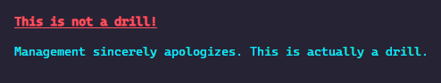

# chalk.ahk

An AutoHotkey library for colorizing terminal output, inspired by the JavaScript
library [chalk](https://github.com/chalk/chalk).

## Installation

The recommended approach for installation is to use [ahkpm][].

`ahkpm install gh:joshuacc/chalk.ahk`

## Usage

Chalk builds colorized strings using property and method chaining, which is easy
both to read and to write

### Example
```autohotkey
; Include chalk.ahk. The path may be different on your system.
#Include, %A_ScriptDir%\ahkpm-modules\github.com\joshuacc\chalk.ahk\chalk.ahk

; Make a terminal styled and colored string
loudWarning := chalk.bold.red.underline("This is not a drill!")

; Output the string to stdOut
FileAppend, %loudWarning%, *

; Make another string
quietCorrection := chalk.cyan("`r`nManagement sincerely apologizes. This is actually a drill.`r`n")

; Output the string to stdOut
FileAppend, %quietCorrection%, *
```

This will produce the following output. (Exact colors vary depending on your terminal settings.)



### Color and styling options

Any of the following color and styling options may be chained together in chalk to produce a string.
For example `chalk.bgWhite.blue.bold("message")` would produce a string that (when output to a terminal)
has a white background, blue text, and is in bold.

#### Text colors:

- black
- red
- green
- yellow
- blue
- magenta
- cyan
- white

#### Background colors:

- bgBlack
- bgRed
- bgGreen
- bgYellow
- bgBlue
- bgMagenta
- bgCyan
- bgWhite

#### Text style options:

- bold
- dim
- italic
- underline
- overline
- inverse
- hidden
- strikethrough

[ahkpm]:https://ahkpm.dev